<div align="center">
	
</div>
<div  align="center">
    <h1>极简多租户管理系统</h1>
    <span>基于SpringBoot3+Vue3前后端分离的Java快速开发脚手架</span>
</div>

## 项目地址

演示地址：[https://www.jjian.com.cn](https://www.jjian.com.cn)

文档地址：[https://apebbs.cn/docs/minimalist-saas/1.0.0/introduction.html](https://apebbs.cn/docs/minimalist-saas/1.0.0/introduction.html)

Gitee：[https://gitee.com/marlife/minimalist-saas](https://gitee.com/marlife/minimalist-saas)

Github：[https://github.com/lmq2582609/minimalist-saas](https://github.com/lmq2582609/minimalist-saas)

管理员账号/密码： `admin`/`111111`  
租户账号/密码：`dongdong`/`111111`  

## 关于本项目

这个项目最初是作者为了巩固技术栈、熟悉多租户架构而写的项目，大家参考看看思路。如果你刚好需要一个带多租户能力的基础脚手架，在这个项目上改改也能用。有想法或者建议欢迎提 Issue 或 PR，一起完善。

## 功能特性

- **用户管理**：用户增删改查、密码重置、状态管理
- **角色管理**：角色分配、权限配置
- **权限管理**：菜单权限配置，支持树形结构
- **部门管理**：部门树形结构管理，支持启用/关闭
- **岗位管理**：岗位信息管理，支持启用/关闭
- **字典管理**：系统级字典配置
- **系统通知**：系统公告与通知管理
- **文件存储**：文件上传与管理，支持本地及云存储（七牛云）
- **租户管理**：租户创建、数据源配置、套餐管理
- **租户套餐**：租户权限套餐分配与同步
- **功能配置**：系统级和租户级功能开关配置
- **接口文档**：集成 Knife4j，自动生成 API 文档

### 多租户架构

- **数据库级隔离**：每个租户独立数据库，数据彻底隔离
- **自动初始化**：创建租户时自动建库建表、插入初始数据
- **主库索引路由**：主库存储用户索引，登录时自动路由到租户库
- **动态数据源**：运行时动态注册/切换租户数据源

## 技术选型

### 前端

| 名称          | 版本     | 说明         |
| ----------- | ------ | ---------- |
| Vue         | 3.2.47 | 前端框架       |
| Vite        | 4.3.2  | 构建工具       |
| Arco-Design | 2.45.3 | UI 组件库     |
| Windicss    | 3.5.6  | CSS 框架     |
| Vue-Router  | 4.1.6  | 路由         |
| Vueuse      | 10.1.2 | 工具函数库      |
| Axios       | 1.4.0  | HTTP 客户端   |
| Pinia       | 2.0.36 | 状态管理       |
| Tinymce     | 6.6.0  | 富文本编辑器     |

### 后端

| 名称                 | 版本     | 说明      |
| ------------------ | ------ | ------- |
| Java               | 17     |         |
| SpringBoot         | 3.1.1  | 开发框架    |
| Mybatis-flex       | 1.9.7  | ORM 框架  |
| Satoken            | 1.39.0 | 权限认证框架  |
| Dynamic-Datasource | 4.3.1  | 多数据源管理  |
| Redisson           | 3.36.0 | Redis 客户端 |
| Knife4j            | 4.1.0  | API 文档   |
| Hutool             | 5.8.32 | 工具库     |
| Mica-xss           | 3.3.2  | XSS 防护  |

### 中间件

| 名称    | 版本     |
| ----- | ------ |
| MySQL | 8.0.24 |
| Redis | 7.2.4  |

## 快速开始

### 环境要求

| 环境      | 版本要求 |
| --------- | ------ |
| JDK       | 17+    |
| Maven     | 3.6+   |
| MySQL     | 8.0+   |
| Redis     | 7.0+   |
| Node.js   | 16+    |

### 后端启动

1. **克隆项目**

```bash
git clone https://gitee.com/marlife/minimalist-saas.git
cd minimalist-saas
```

2. **初始化数据库**

创建 MySQL 数据库 `minimalist`，执行 SQL 脚本：

```
resources/sql/mysql/minimalist_全部sql,如果是第一次使用本项目直接执行这个.sql
```

3. **修改配置**

编辑 `minimalist-application/src/main/resources/application-dev.yml`，修改数据库和 Redis 连接信息。

4. **启动项目**

运行 `MinimalistBasicApplication` 启动类，默认端口 `http://localhost:9090/minimalist`。

### 前端启动

```bash
cd minimalist-vue3
npm install
npm run dev
```

## 项目结构

```
minimalist-saas
├── minimalist-application    # 启动模块（配置文件、启动类）
├── minimalist-basic          # 基础模块（业务代码）
│   ├── config                # 配置类（数据源、Sa-Token、多租户等）
│   ├── controller            # 控制器
│   ├── entity                # 实体类（PO / VO）
│   ├── mapper                # MyBatis-Flex Mapper
│   ├── service               # 业务服务层
│   ├── manager               # 通用业务处理
│   ├── mq                    # 消息队列（Redis Pub/Sub）
│   └── utils                 # 工具类
├── minimalist-vue3           # 前端项目（Vue3 + Vite + Arco Design）
├── resources/sql             # SQL 脚本
└── docs                      # 设计文档
```

## 部署说明

### 后端打包

```bash
# 开发环境
mvn clean package -P dev

# 生产环境
mvn clean package -P prod
```

生成 `minimalist-application/target/minimalist-saas-backend.jar`，启动：

```bash
java -jar minimalist-saas-backend.jar --spring.profiles.active=prod
```

### 前端打包

```bash
cd minimalist-vue3
npm run build:prod
```

产物在 `dist/` 目录，部署到 Nginx 即可。

## 演示图

<table>
    <tr>
        <td></td>
        <td>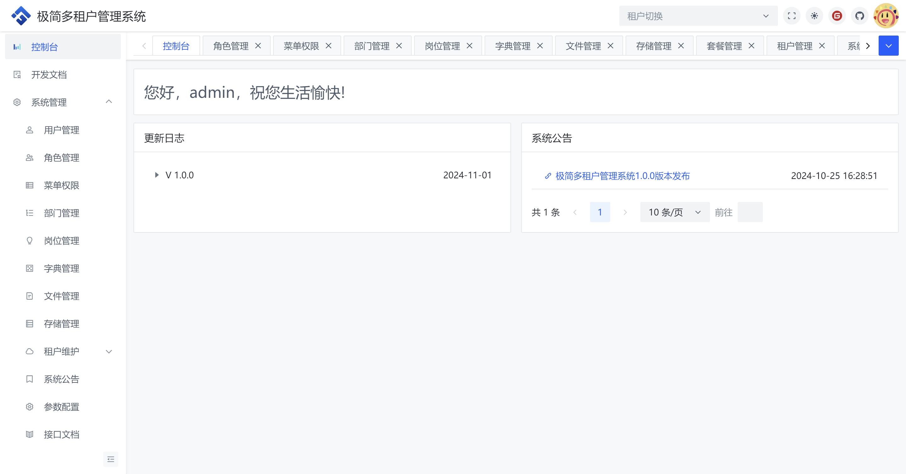</td>
    </tr>
    <tr>
        <td>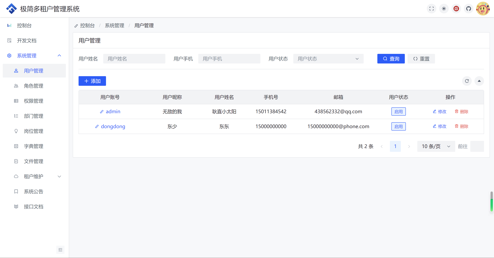</td>
        <td>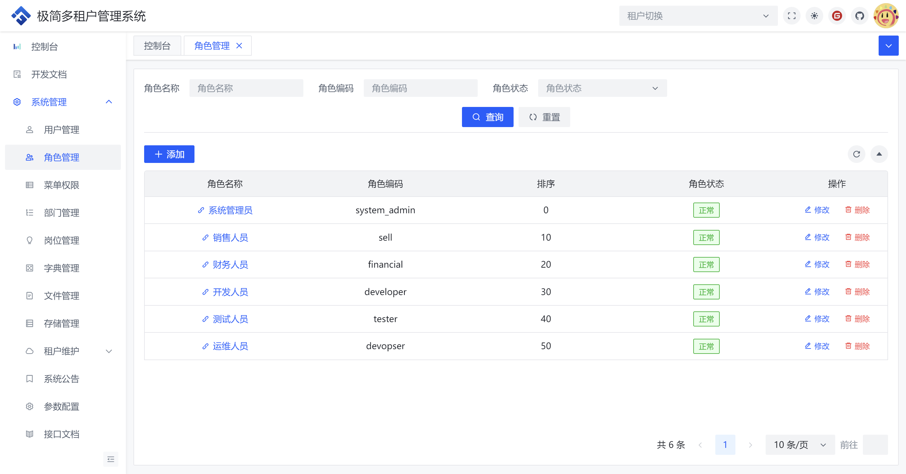</td>
    </tr>
    <tr>
        <td>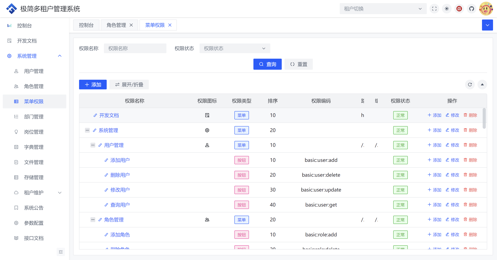</td>
        <td>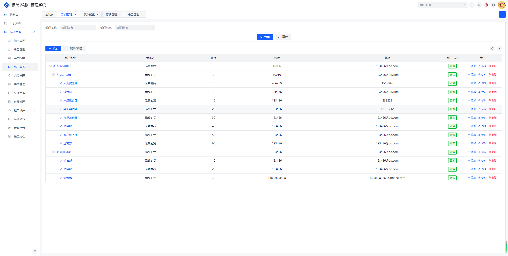</td>
    </tr>
    <tr>
        <td>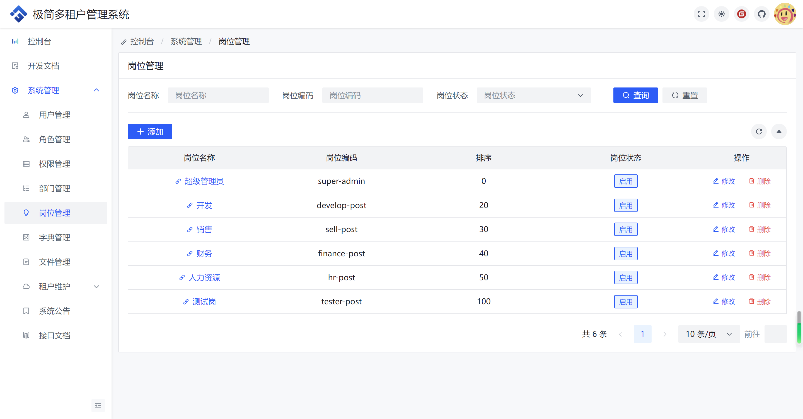</td>
        <td>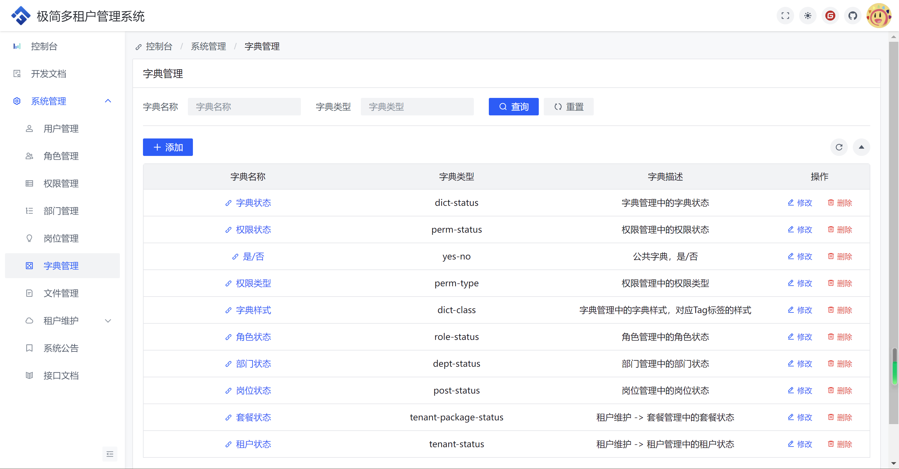</td>
    </tr>
    <tr>
        <td>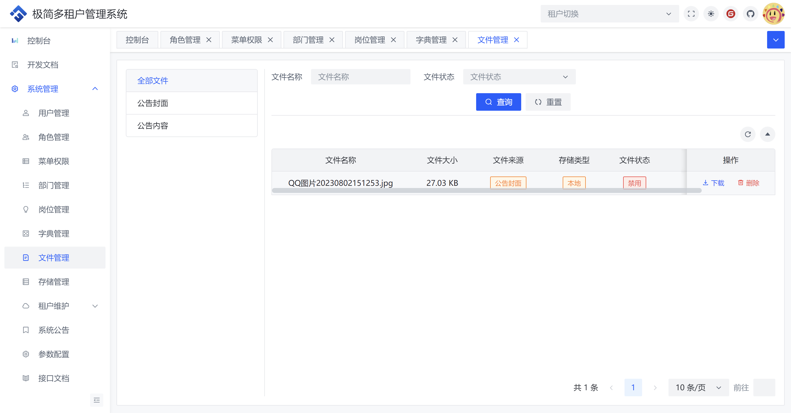</td>
        <td>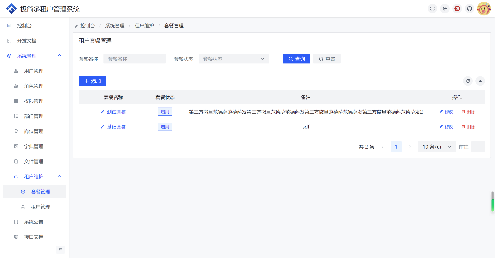</td>
    </tr>
    <tr>
        <td>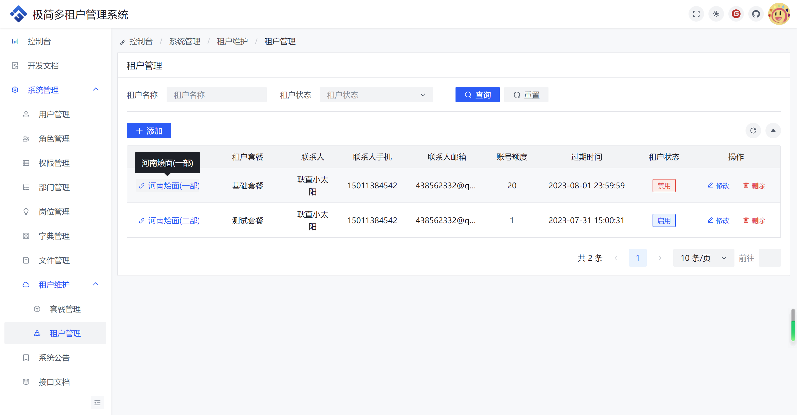</td>
        <td>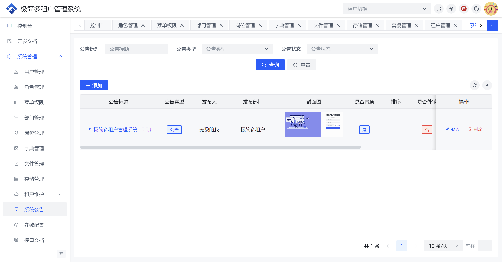</td>
    </tr>
    <tr>
        <td>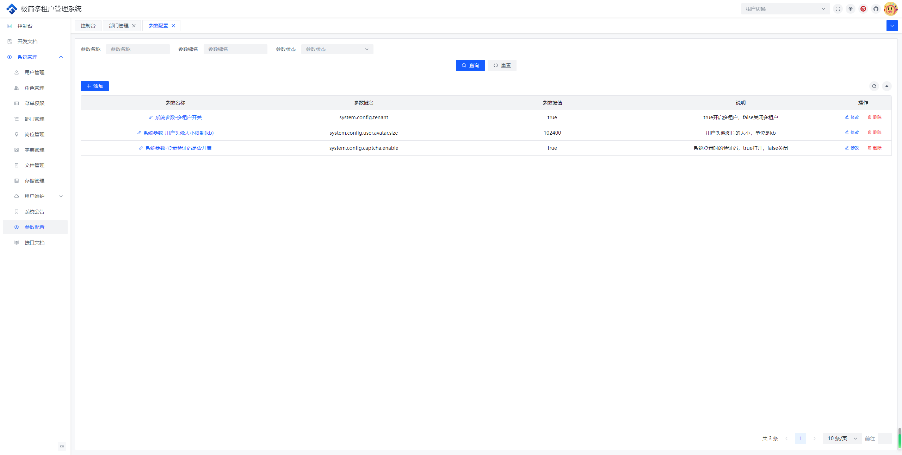</td>
        <td>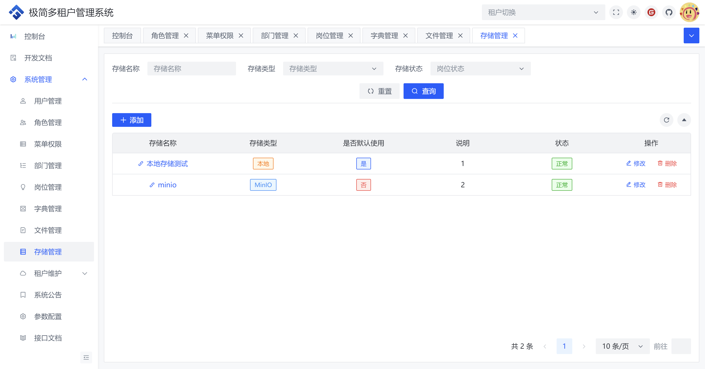</td>
    </tr>
    <tr>
        <td>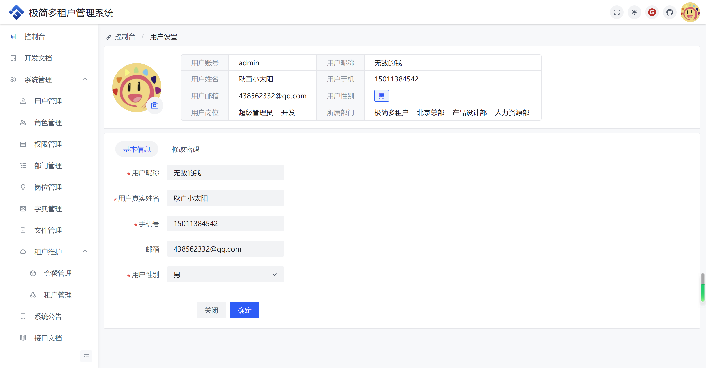</td>
        <td>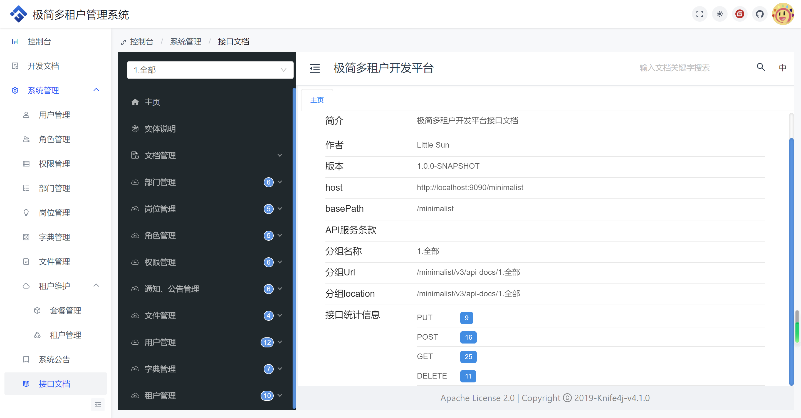</td>
    </tr>
</table>

## 开源协议

[MIT License](LICENSE)

Copyright (c) 2023 小太阳
