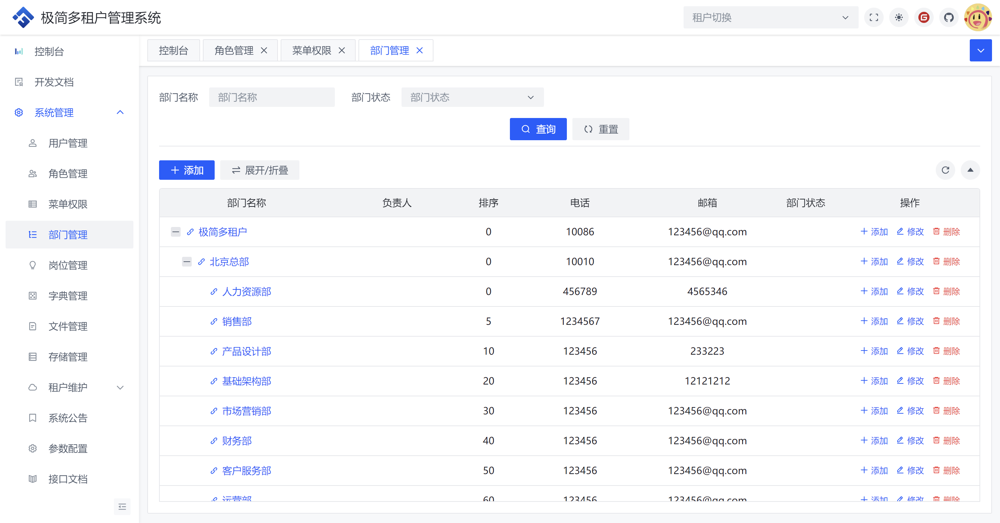
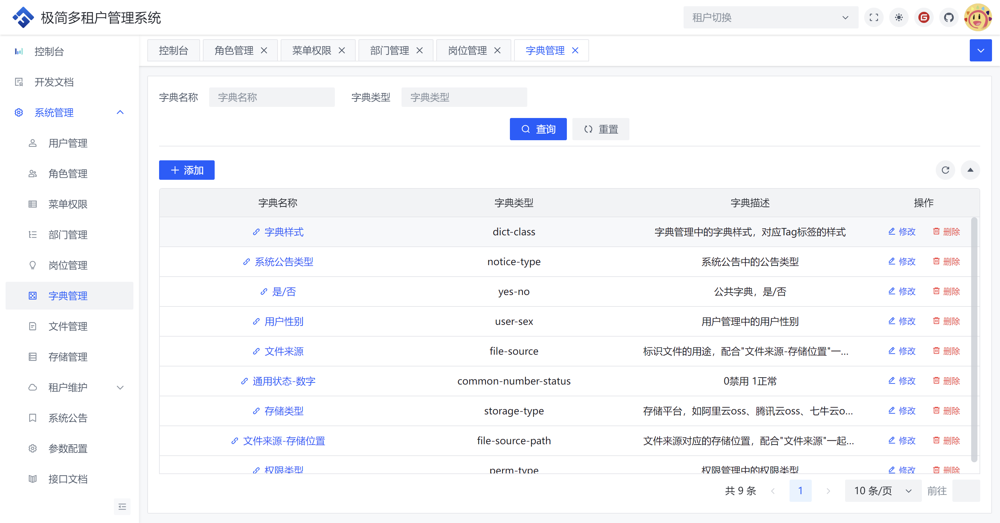
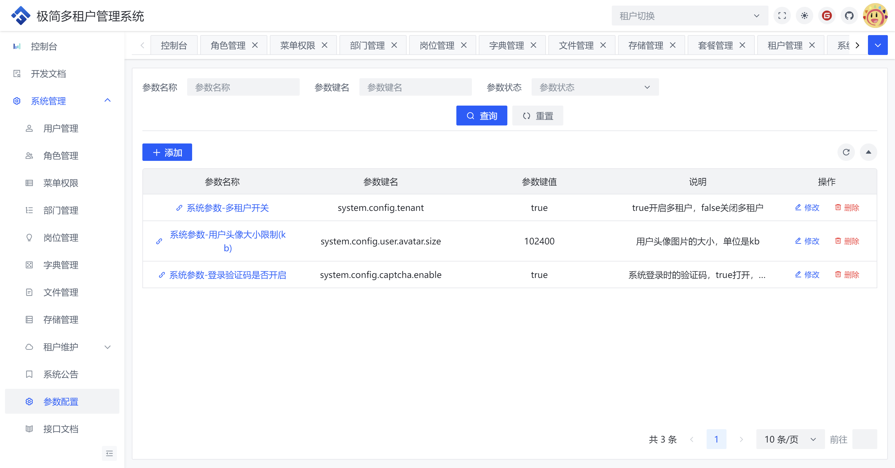

	

    <h1>极简多租户管理系统</h1>
    基于SpringBoot3+Vue3前后端分离的Java快速开发脚手架

## 项目简介

极简多租户管理系统是一个多租户管理系统，基于SpringBoot3+Vue3的前后端分离的后台开发脚手架，具备一些常用的基础功能。

## 项目地址

演示地址：部署中...

文档地址：编写中...

Gitee：https://gitee.com/marlife/minimalist-saas

Github：https://github.com/lmq2582609/minimalist-saas

管理员账号/密码：admin/111111

## 技术选型
### 前端

| 名称          | 版本     | 说明                      |
| ----------- | ------ | ----------------------- |
| Vue         | 3.2.47 | 用于构建用户界面的 JavaScript 框架 |
| Vite        | 4.3.2  | 前端构建工具                  |
| Arco-Design | 2.45.3 | 字节出的 Vue3 UI 组件库        |
| Windicss    | 3.5.6  | CSS 框架                  |
| Vue-Router  | 4.1.6  | Vue官方路由                 |
| Vueuse      | 10.1.2 | 基于Composition API的实用函数库 |
| Axios       | 1.4.0  | 基于Promise的HTTP客户端       |
| Pinia       | 2.0.36 | Vue 状态管理                |
| Vue-Cropper | 1.0.9  | 图片裁剪                    |
| Nprogress   | 0.2.0  | 进度条                     |
| Tinymce     | 6.6.0  | 富文本编辑器                  |

### 后端

| 名称                         | 版本     | 说明                      |
| -------------------------- | ------ | ----------------------- |
| Java                       | 17     | 无需多言                    |
| SpringBoot                 | 3.1.1  | Java开发框架                |
| Redisson                   | 3.36.0 | Redis Java客户端           |
| Mysql                      | 8.0.33 | Mysql数据库驱动              |
| Mybatis-flex               | 1.9.7  | ORM框架                   |
| Hutool                     | 5.8.32 | Java工具库                 |
| Satoken                    | 1.39.0 | Java权限认证框架              |
| Knife4j                    | 4.1.0  | Swagger2和OpenAPI3增强解决方案 |
| Mica-xss                   | 3.3.2  | xss防护                   |
| Transmittable-Thread-Local | 2.14.3 | ThreadLocal增强，跨线程传递     |
## 中间件

| 名称    | 版本     | 说明       |
| ----- | ------ | -------- |
| mysql | 8.0.24 | 关系型数据库   |
| redis | 7.2.4  | NoSQL数据库 |
## 演示图

<table>
    <tr>
        <td></td>
        <td></td>
    </tr>
    <tr>
        <td></td>
        <td></td>
    </tr>
    <tr>
        <td></td>
        <td></td>
    </tr>
    <tr>
        <td></td>
        <td></td>
    </tr>
    <tr>
        <td></td>
        <td></td>
    </tr>
    <tr>
        <td></td>
        <td></td>
    </tr>
    <tr>
        <td></td>
        <td></td>
    </tr>
    <tr>
        <td></td>
        <td></td>
    </tr>
</table>
