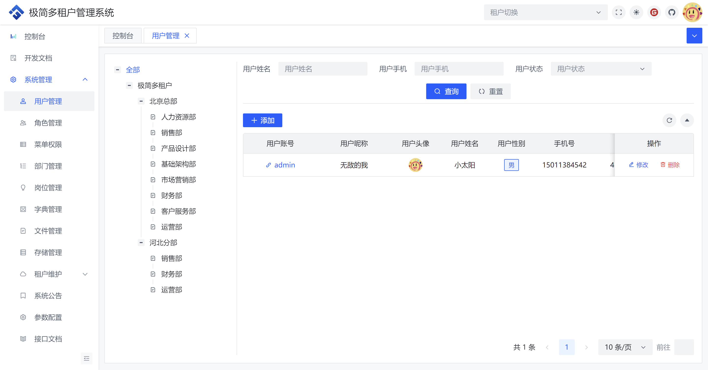
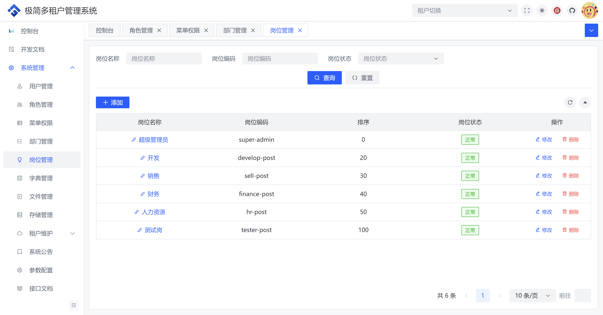
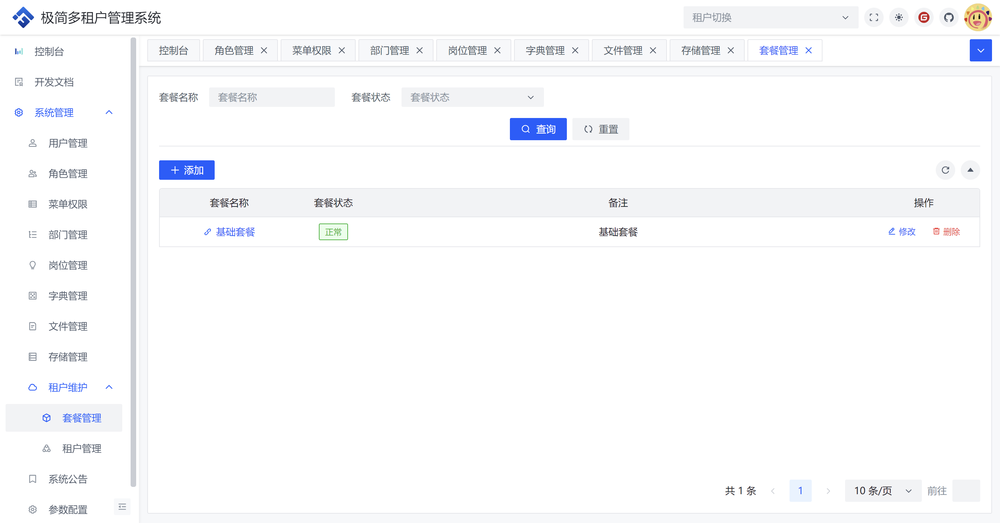
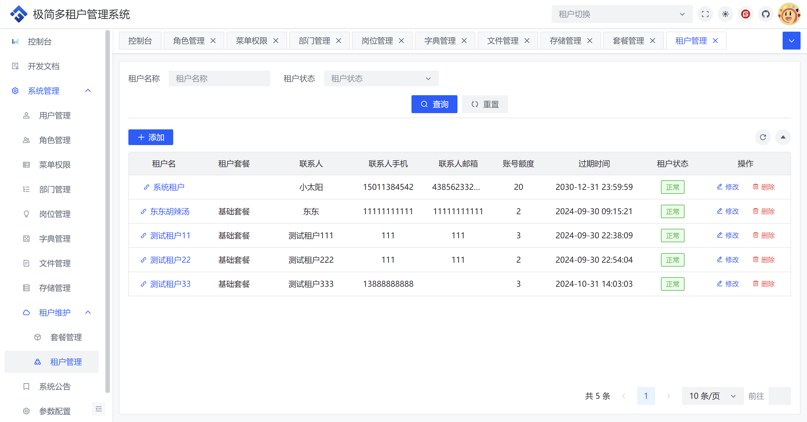

	

    <h1>极简多租户管理系统</h1>
    基于SpringBoot3+Vue3前后端分离的Java快速开发脚手架

## 项目简介
极简多租户管理系统是一个基于数据库字段隔离的多租户管理系统，具备常规基础功能的单体应用。项目中只提供了一些基础功能，算是一个多租户系统的基础版，因为我也要用这个基础版，所以顺便将基础版代码开源，希望提供给有需要的人。

## 在线体验

演示地址：http://

详细文档：http://

## 技术体系

- 前端：Vue3 + Vue-router + Pinia + Vite + VueUse + Windicss + arco-design-vue
- 后端：Java17 + SpringBoot3.X + Mybatis-Plus + Spring Security + Swagger-Knife4j + Redisson + Mysql

## 演示图
<table>
    <tr>
        <td></td>
        <td></td>
    </tr>
    <tr>
        <td></td>
        <td></td>
    </tr>
    <tr>
        <td></td>
        <td></td>
    </tr>
    <tr>
        <td></td>
        <td></td>
    </tr>
    <tr>
        <td></td>
        <td></td>
    </tr>
    <tr>
        <td></td>
        <td></td>
    </tr>
    <tr>
        <td></td>
        <td></td>
    </tr>
</table>
